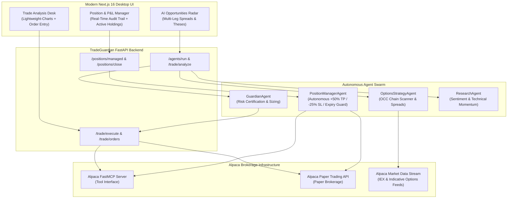

# TradeGuardian 🛡️
### Autonomous Multi-Agent Risk Engine & Options Trading Desk powered by Alpaca FastMCP

TradeGuardian is an institutional-grade, AI-powered autonomous trading and risk management platform submitted to the **Alpaca AI Trading Agents Hackathon on lablab.ai**. It orchestrates specialized autonomous agents to discover options opportunities, verify portfolio safety rules via real-time risk checks, execute trades through the official **Alpaca MCP (Model Context Protocol) Server**, and continuously manage open positions with automated Take-Profit and Stop-Loss guardrails.

---

## 🌟 Hackathon Highlights & Core Criteria

| Criteria | Hackathon Requirement | TradeGuardian Implementation |
| :--- | :--- | :--- |
| **Autonomous AI Agents** | Autonomous trading agents | **4 Specialized Agents:** `GuardianAgent`, `PositionManagerAgent`, `OptionsStrategyAgent`, `ResearchAgent` |
| **Alpaca Tech Stack** | Alpaca MCP Server or CLI | **Alpaca FastMCP Integration:** Direct tool calling (`place_option_order`, `place_stock_order`, `get_all_positions`, `get_account_info`) |
| **Options Strategies** | Incorporate options trading | **Full OCC Contract Handling:** Spreads (Bull Call, Bull Put, Bear Put, Iron Condor), Greeks, DTE calculations, and chain analysis |
| **Paper Trading** | Tested in Alpaca paper account | **100% Live Paper Brokerage:** Connects to `paper-api.alpaca.markets` with zero real capital risk |

---

## 🏛️ System Architecture



---

## 🤖 The Autonomous Multi-Agent Swarm

### 1. `GuardianAgent` (Risk & Compliance Certification)
* Evaluates trade proposals before execution against institutional risk parameters.
* **Checks:**
  * **Account Exposure:** Max 15% portfolio allocation per asset.
  * **Portfolio Concentration:** Max 25% exposure across related underlying derivatives.
  * **Margin & Buying Power:** Prevents over-leveraging and deficit margin calls.
  * **Audit Trail:** Generates unique cryptographic audit certificates saved to SQLite.

### 2. `PositionManagerAgent` (Autonomous P&L & Exit Engine)
* Continuously scans live portfolio positions from Alpaca paper account.
* **Rules:**
  * 🎯 **Take-Profit Target (+50% options / +20% equities):** Automatically flags or executes profit realization.
  * 🛑 **Stop-Loss Guardrail (-25% options / -10% equities):** Autonomous capital preservation.
  * ⏳ **Expiration Guard (DTE $\le 1$ day):** Closes contracts approaching expiry to avoid pin risk and physical exercise.
  * **Graceful MCP / SDK Fallback:** Operates seamlessly via FastMCP tool calls with direct REST failover.

### 3. `OptionsStrategyAgent` (Derivative Chain Engineer)
* Ingests Alpaca Options Feeds (`feed=OptionsFeed.INDICATIVE`).
* Synthesizes and filters OCC standard contracts (`ROOT + YYMMDD + [C/P] + STRIKE`).
* Recommends optimal delta/theta profiles for Directional and Non-Directional options spreads.

### 4. `ResearchAgent` (Market Momentum & Sentiment)
* Pulls live historical minute bars from Alpaca Data API.
* Analyzes short-term momentum, moving average crosses, and relative strength.

---

## ⚡ Real-Time Features

1. **Real-Time Alpaca Order Audit Trail:**
   * Adaptive 2.5s live polling synchronized with SQLite audit logs and Alpaca's order book.
   * Zero-latency reactive updates triggered by `tradeguardian:account_updated` events.
   * Real-time status badge indicators (`FILLED`, `ACCEPTED`, `CANCELED`, `PENDING_NEW`).
   * One-click Alpaca order cancellation directly from the audit trail.

2. **Active Holdings & Options Window Panel:**
   * Full mark-to-market valuation with unrealized P&L and percentage return.
   * Displays underlying symbol, option type (Call/Put), strike price, and Days to Expiration (DTE).
   * Live Guardian Action badges (`HOLD`, `TAKE_PROFIT`, `STOP_LOSS`, `EXPIRATION_GUARD`).
   * Transparent "Orders Pending Fill" indicator for orders submitted during pre-market or after-hours.

---

## 🛠️ Tech Stack

* **Frontend:** Next.js 16 (App Router), React 19, TypeScript, TailwindCSS v4, Lightweight-Charts.
* **Backend:** Python 3.12, FastAPI, Pydantic v2, SQLite3, Uvicorn.
* **Alpaca Integration:** `alpaca-py==0.44.0`, `alpaca-mcp-server>=0.2.1`, `fastmcp[server]>=3.2.0`.
* **Protocol:** Model Context Protocol (MCP) by Anthropic / Alpaca.

---

## 🚀 Getting Started

### 1. Prerequisites
* Python 3.11 or 3.12
* Node.js 18+ and npm
* An [Alpaca Paper Trading Account](https://app.alpaca.markets/signup)

### 2. Environment Configuration
Create a `.env` file in the `backend/` directory:

```env
ALPACA_API_KEY=your_alpaca_paper_api_key
ALPACA_SECRET_KEY=your_alpaca_paper_secret_key
ALPACA_BASE_URL=https://paper-api.alpaca.markets
ALPACA_DATA_URL=https://data.alpaca.markets
ALPACA_PAPER=true
```

In the `frontend/` directory (optional for custom ports):
```env
NEXT_PUBLIC_BACKEND_URL=http://localhost:8000
```

### 3. Backend Setup
```bash
cd backend
python -m venv .venv
source .venv/bin/activate  # On Windows: .venv\Scripts\activate
pip install -r requirements.txt
uvicorn main:app --host 0.0.0.0 --port 8000 --reload
```
The FastAPI documentation is available at `http://localhost:8000/docs`.

### 4. Frontend Setup
```bash
cd frontend
npm install
npm run dev
```
Open `http://localhost:3000` in your browser.

---

## 🏆 Lablab.ai Hackathon Verification

* **Alpaca MCP Server Tools Verified:**
  * `place_option_order`
  * `place_stock_order`
  * `get_all_positions`
  * `close_position`
  * `get_account_info`
* **Real-time Order Audit Trail Status:** Real-time stream active.
* **Options Compliance:** OCC compliant contract generation and Greeks evaluation.

---

## 📜 License
MIT License. Developed for the Alpaca AI Trading Agents Hackathon on lablab.ai.